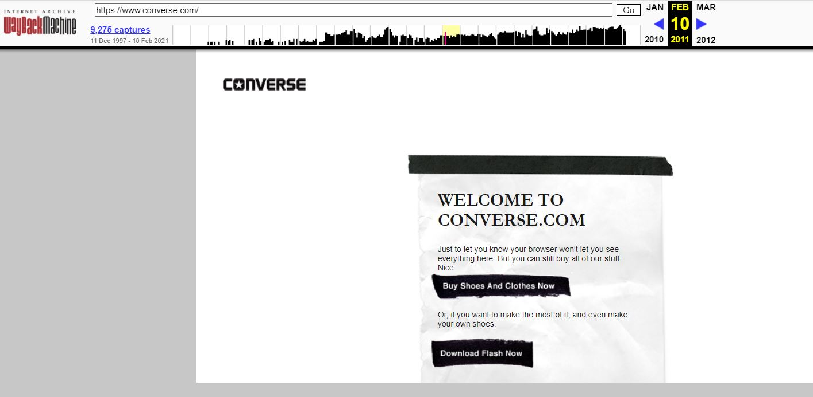

1. I went back to converse.com because it was a business that I know has been around for awhile.  It looked really weird.  Just the very basics were on the page a button is what you pressed on to go to different areas.  Nothing like the search bar, search and filter, or pictures we see as soon as we open a page on every store website today.

2. My experience with these topics was good.  It was a nice refresher of coding one.  I don't think there's anything that I don't understand currently.

3. 
