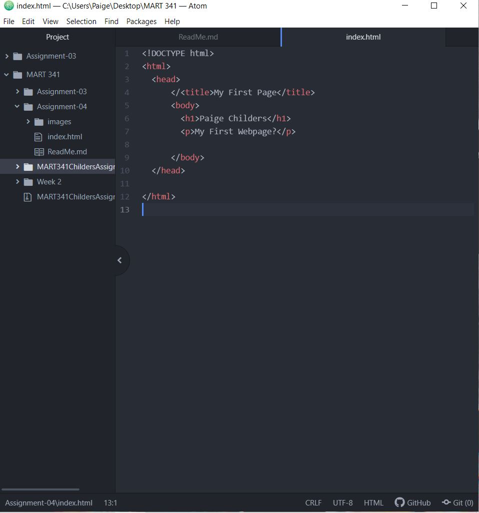

1. Browsers open information and display the visuals of the webpage.  Browsers have to use the internet and networks to fetch data.  A browser uses HTML and CSS to display the web pages properly. They also rely on programming languages and have a rendering engine.
I use the Google and Safari browsers when I surf the web.
2. Markup language is the programming language that says what the webpage is going to look like.  Markup languages put emphasis on text content.  HTML is commonly used as a markup language as it allows other things to be attached to the page.
3. 
